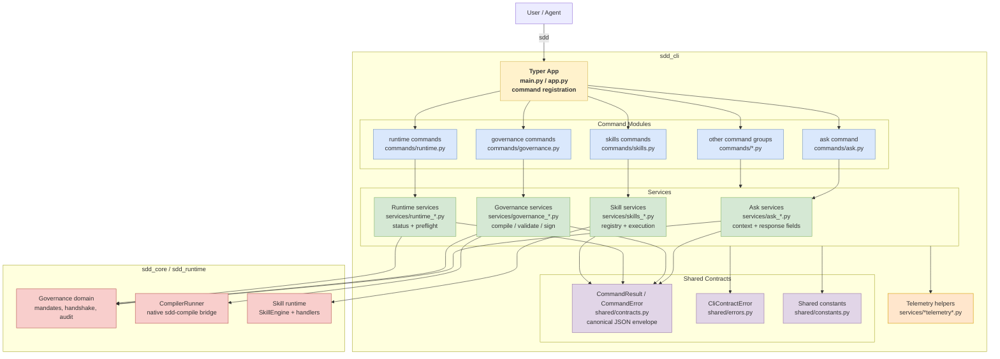

# C4 Level 3 - Components: sdd_cli

Internal structure of the `sdd_cli` package, focused on command dispatch and the
canonical JSON envelope.



## Key Flows

### Command dispatch

```
user / agent
  -> Typer app
  -> command module
  -> service function
  -> shared CommandResult envelope when JSON output is emitted
```

Command modules own the CLI surface: arguments, options, Typer callbacks, and
console wiring. Service modules own the reusable workflow and should return
plain data structures that command modules can format.

### Canonical JSON envelope

```
command handler
  -> build_ok_result(command, data)
  -> CommandResult.as_dict()
  -> JSON response with status, command, ok, error, data, schema_version
```

Errors use the same envelope:

```
command handler
  -> build_error_result(command, data, code=..., message=...)
  -> CommandError
  -> JSON response with ok=false and structured error
```

The envelope contract is centralized in
`packages/interfaces/sdd_cli/src/sdd_cli/shared/contracts.py`. Command handlers
must not build alternate JSON shapes when emitting machine-readable output.

## Boundaries

- `sdd_cli.commands` maps user intent to service calls and output mode.
- `sdd_cli.services` coordinates governance, runtime, compiler, and filesystem
  interactions.
- `sdd_cli.shared` owns cross-command contracts and errors.
- `sdd_core` and `sdd_runtime` remain upstream dependencies; `sdd_cli` must not
  reimplement governance or runtime policy.

## Contract Ownership

The CLI JSON envelope follows ADR-006 and the follow-up decision in ADR-016.
The current contract keeps frozen dataclasses as the runtime model and uses a
manually maintained JSON Schema for consumer-facing validation.
