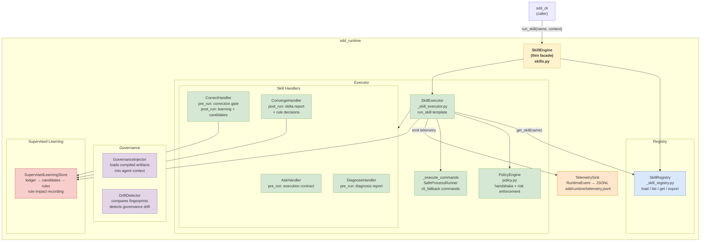

# C4 Level 3 — Components: sdd_runtime

Internal structure of the `sdd_runtime` execution engine.



## Key Flows

### Skill execution (`sdd ask "..."`)
```
sdd_cli → SkillEngine.run_skill("sdd-ask", context)
  → SkillRegistry.get_skill("sdd-ask")
  → PolicyEngine.evaluate_skill_policy()
  → AskHandler.pre_run()  # builds execution contract
  → SkillExecutor._execute_commands()  # runs cli_fallback
  → TelemetrySink.emit(RuntimeEvent)
```

### Correction with gate (`sdd correct`)
```
sdd_cli → SkillEngine.run_skill("sdd-correct", context)
  → CorrectHandler.pre_run()
      → _evaluate_correction_gate()  # evidence / confidence / scope checks
      → if deny: SupervisedLearningStore.append_failure() → early exit
  → SkillExecutor._execute_commands()
  → CorrectHandler.post_run()
      → SupervisedLearningStore.append_failure()
      → SupervisedLearningStore.generate_candidates_from_ledger()
```

### Handler discovery (`_get_skill_handler`)
```
name = "sdd-correct"
suffix = "correct"
class_name = "CorrectHandler"
cls = globals()["CorrectHandler"]  # in _skill_executor.py
return cls()
```
