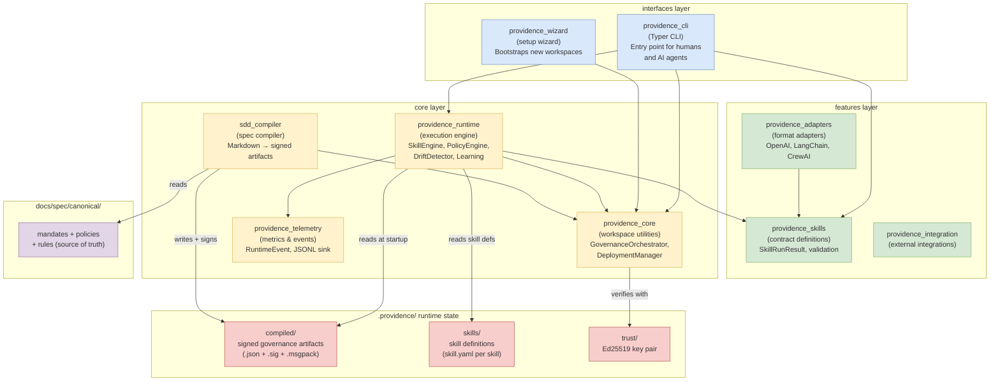

# C4 Level 2 — Containers

The major packages of Providence and their dependency relationships.

## Layer Rules

Imports are strictly enforced by `pyproject.toml` `[tool.sdd.architecture]`:

- **interfaces** may import **features** and **core**
- **features** may import **core** only
- **core** packages do not import from **interfaces** or **features**

Violating these rules is caught by the architecture contract tests in `tests/contract/`.

## Scope Note — Publication Topology Is Not Shown Here

The diagram above is the **Python package import graph** enforced by the
layer rules — it does not represent runtime deployment or the published
site's URL topology. `apps/landing/` (Astro + React) and the Selector
(static assets compiled by `providence_wizard`'s `selector_compiler.py`) are not
Python packages that participate in this import contract, so they
intentionally aren't nodes in this graph.

The actual publication topology — `/` (Astro landing), `/docs/` (MkDocs),
`/selector/` (Selector), all assembled into one `build/site/` artifact by
`providence_pages` — is recorded in
`.analysis/archived/selector-landing-mkdocs-refinement-20260702-adr.md`,
not here. A dedicated deployment/publication diagram would be a separate
addition, not a change to this import-graph diagram.
