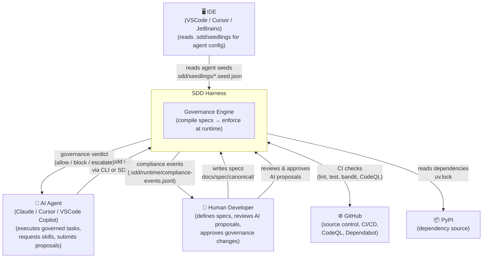

# C4 Level 1 — System Context

Who uses SDD Harness and what external systems does it interact with.

## Key Points

- **Human Developer** is the sole normative authority — specs in `docs/spec/canonical/` are the source of truth
- **AI Agents** interact exclusively through the `sdd` CLI and governed skill pipeline — they cannot modify specs directly
- **GitHub CI** enforces quality gates (lint, mypy, bandit, coverage, CodeQL) on every push
- **IDE integration** reads `.sdd/seedlings/` to configure agent behavior in VSCode, Cursor, etc.
