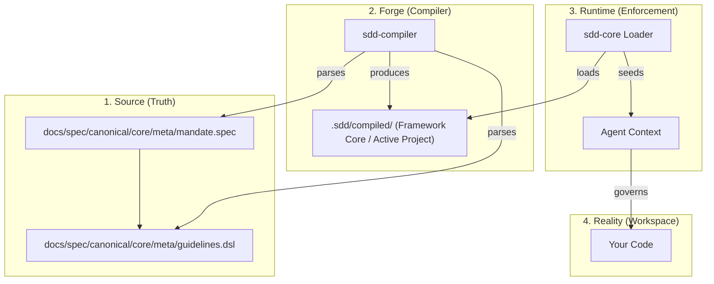

# 🧠 SDD Semantic Navigation Map (Knowledge Graph)

> [!IMPORTANT]
> **For AI Agents:** This document is your internal "compass". It maps the semantic relationship between the **Documentation (Truth)** and the **Code (Implementation)**. Use this to maintain context during deep architectural reasoning.

## 🔗 The Golden Thread: Governance Lifecycle

The lifecycle of an architectural rule in SDD v3.0 follows a deterministic path. When an agent is asked to "verify" or "implement" something, refer to this flow:

## 📍 Semantic Anchors (Where to Find What)

| Topic | Primary Documentation (Truth) | Core Implementation (Enforcement) |
| :--- | :--- | :--- |
| **Architectural Rules** | [core/mandates/INDEX.md](./core/mandates/INDEX.md) | `packages/core/sdd_core` |
| **Code Generation** | [features/CUSTOMIZATION_GOVERNANCE.md](./features/CUSTOMIZATION_GOVERNANCE.md) | `packages/core/sdd_compiler` |
| **Pipeline & Setup** | [specifications/testing.md](./specifications/testing.md) | `packages/features/sdd_integration` |
| **CLI & Tools** | [specifications/security-model.md](./specifications/security-model.md) | `packages/interfaces/sdd_cli` |
| **Wizard & Onboarding** | [guides/onboarding/README.md](../guides/onboarding/README.md) | `packages/interfaces/sdd_wizard` |
| **Token Economy** | [core/economy/INDEX.md](./core/economy/INDEX.md) | `packages/core/sdd_runtime/src/sdd_runtime/telemetry.py` |

## 🏗️ Layered Logic Map

### Layer 1: The Mandate Layer (Immortal)

- **Files**: `core/meta/mandate.spec`
- **Context**: These are the "Natural Laws" of the project. If an implementation violates a Mandate, it must be rejected immediately.
- **Search Key**: `M001`, `M002`, `M003`, `economy.*`, `budget_utilization_pct`, `tokens_input`, `compression_ratio`

### Layer 2: The Specification Layer (Configurable)

- **Files**: `specifications/*.md`
- **Context**: Detailed technical definitions (DoD, TDD, Security). These interpret the Mandates for daily work.
- **Search Key**: `Definition of Done`, `Security Model`

### Layer 3: The Implementation Layer (Ephemeral)

- **Files**: `packages/*`
- **Context**: The actual Python code. It is subject to continuous audit by the SDD Doctor and Compliance tools.

## 📁 Standardized Artifact Hierarchy (.sdd/)

To ensure portability and single source of truth, all operational governance state is consolidated in the `.sdd/` canonical control plane:

| Path | Purpose | Ownership |
| :--- | :--- | :--- |
| `.sdd/profile/` | Active profile and workspace ID metadata | Framework |
| `.sdd/compiled/` | Executable governance (binary msgpack/JSON metadata) | Framework (Immutable via Compiler) |
| `.sdd/source/` | Semantic governance source, indices, and guidelines | Project (Customizable) |
| `.sdd/runtime/` | Operational state (telemetry, handshake responses, logs) | Runtime Engine |
| `/generated/client/build/` | Temporary wizard states and output templates | Project Wizard |

## 🧭 Deep Navigation Tips for Agents

1. **Context Loading**: When starting a task, first read `docs/spec/canonical/INDEX.md` for a high-level view, then jump to the specific `.md` file in `specifications/` related to the task.
2. **Cross-Reference**: If a documentation file mentions a "Phase", refer to `packages/interfaces/sdd_wizard/orchestration/` to see the actual logic of that phase.
3. **Governance Refresh**: If you modify the core specification, you MUST run `sdd governance validate` and then `sdd doctor run` to ensure the system hasn't drifted.
4. **Truth Source**: Always trust the `.spec` and `.dsl` files over the compiled `.bin` artifacts if there is a discrepancy (as artifacts are just optimized derivatives).

## 📚 Historical Context (The Archive)

For architectural history or rationale behind the v2.1 -> v3.0 transition:

- **Migration Analyses**: `docs/archive/migration_analyses/`
- **Migration Guides**: `docs/archive/migration_guides/`

---
**Standard:** World Class Engineering - v3.0 (Semantic Interoperability)
**Target Audience:** Autonomous Agents & Lead Architects
